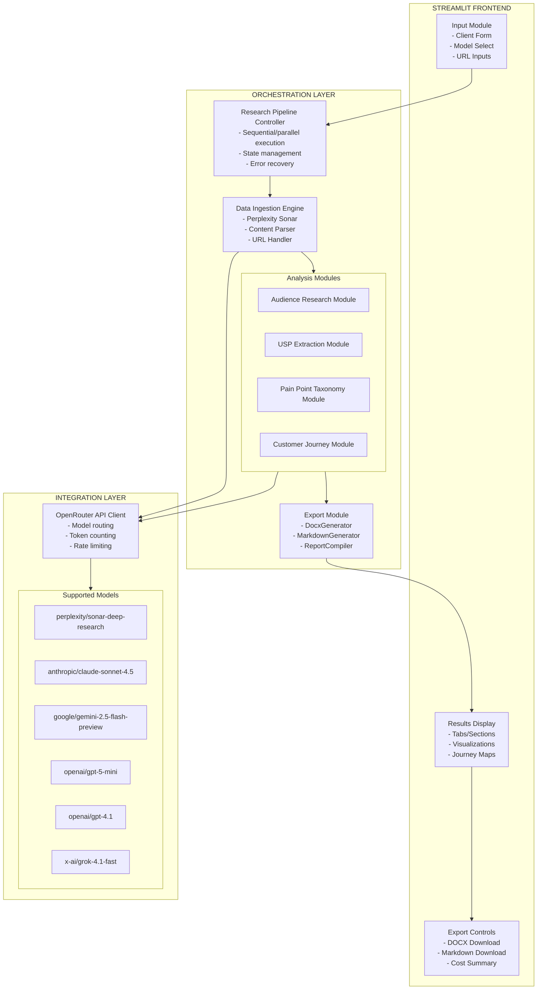
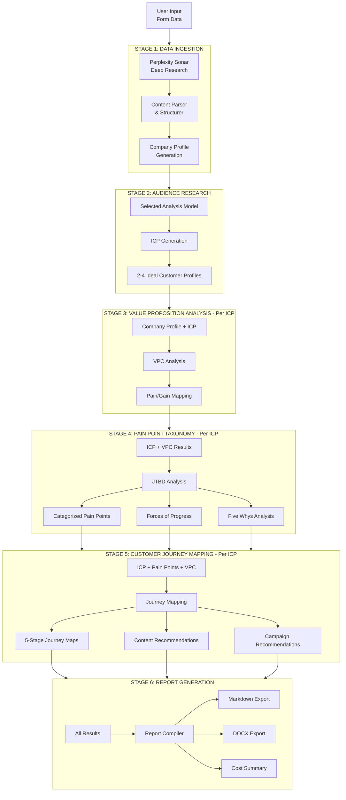
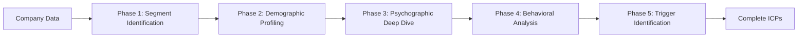
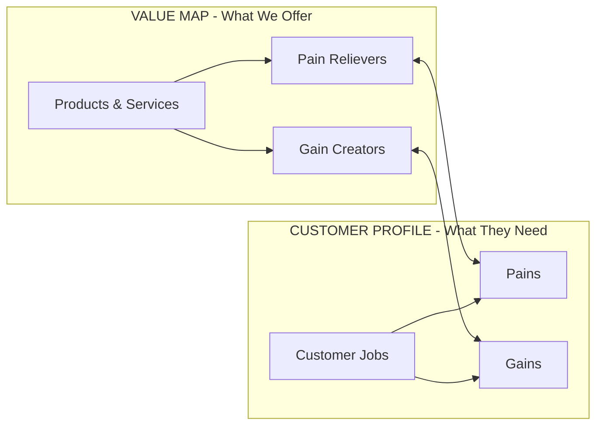
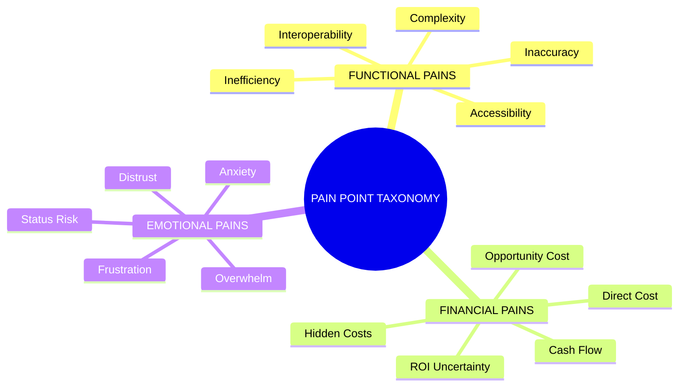
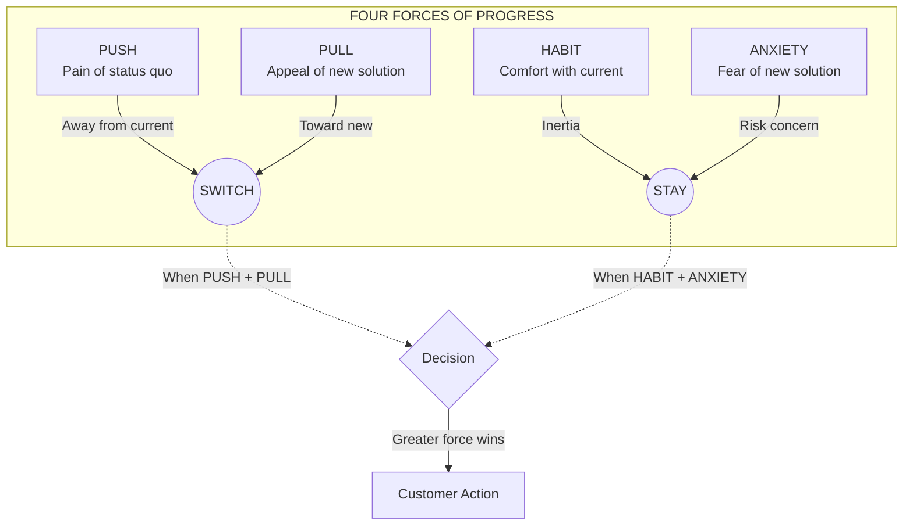
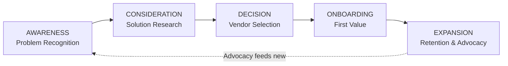
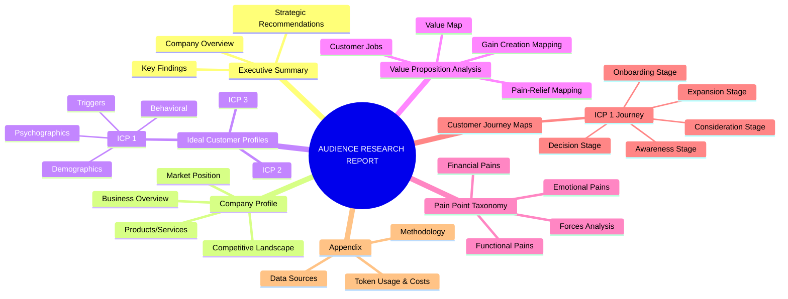

# Cognitive Resonance Engine - Application Architecture

## Executive Summary

The **Cognitive Resonance Engine** is an AI-powered audience research platform that transforms basic client information into comprehensive market intelligence. The application leverages multiple Large Language Models (LLMs) through OpenRouter API to conduct deep-dive audience analysis, extract unique selling propositions, map pain points using Jobs-to-be-Done (JTBD) methodology, and generate customer journey maps.

### Core Capabilities
- **Automated Web Research**: Using Perplexity Sonar Deep Research for intelligent content gathering
- **Multi-Model Analysis**: Support for 6 different LLM models via OpenRouter
- **Comprehensive ICP Generation**: Ideal Customer Profiles with psychographic and behavioral dimensions
- **Value Proposition Mapping**: Automated extraction using the Value Proposition Canvas framework
- **Pain Point Taxonomy**: JTBD-based friction categorization (Functional, Financial, Emotional)
- **Customer Journey Mapping**: 5-stage journey maps (Awareness, Consideration, Decision, Onboarding, Expansion)
- **Export Functionality**: DOCX and Markdown report generation
- **Cost Tracking**: Token usage monitoring and cost estimation

---

## System Architecture Overview



---

## Data Flow Architecture



---

## Module Specifications

### 1. Input Module

**Purpose**: Collect client information through a structured form interface.

**Input Fields**:
| Field | Type | Required | Description |
|-------|------|----------|-------------|
| `client_name` | Text | Yes | Business/Brand name |
| `website_url` | URL | Yes | Main website URL |
| `about_page_url` | URL | No | About Us page URL |
| `products_services_url` | URL | No | Products/Services page URL |
| `additional_urls` | List of URL | No | Other relevant pages |
| `industry` | Dropdown | Yes | Industry category |
| `business_model` | Radio | Yes | B2B / B2C / Both |
| `target_market` | Text | No | Geographic/demographic focus |
| `known_competitors` | Text | No | Competitor names/URLs |
| `additional_context` | TextArea | No | Any other relevant information |

**Model Selection**:
- Dropdown for analysis model selection
- Perplexity Sonar always used for initial research
- User selects model for analysis phases

---

### 2. Data Ingestion Engine

**Purpose**: Gather comprehensive information about the client using AI-powered web research.

**Components**:

#### 2.1 Perplexity Sonar Integration

```python
class DataIngestionEngine:
    """
    Responsible for web research and content gathering using Perplexity Sonar.
    """
    
    def research_company(self, urls: List[str], context: dict) -> CompanyProfile:
        """
        Conducts deep research on the company using provided URLs.
        
        Research Areas:
        - Company overview and history
        - Products/services offered
        - Value propositions - claimed
        - Target audience - stated
        - Brand voice and messaging
        - Industry positioning
        - Competitor landscape
        """
        pass
    
    def extract_content(self, url: str) -> PageContent:
        """
        Extracts and structures content from a given URL.
        """
        pass
```

#### 2.2 Research Query Templates
```
Query 1: Company Overview
"Provide a comprehensive overview of [company_name] including:
- Business nature and industry
- Core products/services
- Founding history and key milestones
- Company size and market presence
- Mission and vision statements
Based on their website: [website_url]"

Query 2: Value Proposition Analysis
"Analyze the unique value propositions of [company_name] by examining:
- Key differentiators from competitors
- Main benefits communicated to customers
- Pricing positioning
- Quality/service promises
Reference: [about_url], [products_url]"

Query 3: Target Audience Indicators
"Research [company_name]'s target audience by analyzing:
- Language and messaging used on website
- Case studies or testimonials mentioned
- Industry verticals served
- Customer segments addressed"

Query 4: Competitive Landscape
"Identify the main competitors of [company_name] in the market and analyze:
- Direct competitors
- Market positioning relative to competitors
- Unique differentiators"
```

**Output Schema**:
```python
@dataclass
class CompanyProfile:
    name: str
    website: str
    industry: str
    business_model: str  # B2B, B2C, Both
    overview: str
    products_services: List[ProductService]
    stated_value_propositions: List[str]
    stated_target_audience: str
    brand_voice: BrandVoice
    competitors: List[Competitor]
    raw_content: Dict[str, str]  # URL -> extracted content
```

---

### 3. Audience Research Module

**Purpose**: Generate comprehensive Ideal Customer Profiles (ICPs) with multi-dimensional segmentation.

**Framework**: Multi-Dimensional Orthogonality (Demographics + Behavioral + Psychographics + Value-Based)

#### 3.1 ICP Generation Process



**Phase Details**:
- **Phase 1**: Analyze company data, identify 2-4 primary segments
- **Phase 2**: B2B firmographics or B2C demographics
- **Phase 3**: Motivations, values, decision style, risk tolerance
- **Phase 4**: Buying patterns, channel preferences, engagement
- **Phase 5**: Motivations, pain points, goals, fears

#### 3.2 ICP Output Schema

```python
@dataclass
class IdealCustomerProfile:
    icp_id: str
    icp_name: str  # e.g., "The Efficiency-Driven Operations Manager"
    segment_size_estimate: str  # "Primary", "Secondary", "Niche"
    
    # Demographics/Firmographics
    demographics: Demographics
    
    # Psychographics
    psychographics: Psychographics
    
    # Behavioral
    behavioral: BehavioralProfile
    
    # Triggers
    motivations: List[Motivation]
    pain_points: List[PainPoint]
    goals: List[Goal]
    fears: List[Fear]
    
    # Summary
    one_liner: str  # Elevator pitch description
    detailed_narrative: str  # 2-3 paragraph profile

@dataclass
class Psychographics:
    core_values: List[str]
    aspirations: List[str]
    decision_style: str  # "Analytical", "Intuitive", "Collaborative", "Decisive"
    risk_tolerance: str  # "Risk-Averse", "Moderate", "Risk-Seeking"
    personality_indicators: Dict[str, str]  # Big Five estimates
    lifestyle_priorities: List[str]

@dataclass
class BehavioralProfile:
    buying_process: str  # Description of how they buy
    research_channels: List[str]  # Where they seek information
    decision_timeline: str  # "Quick", "Moderate", "Extended"
    key_influencers: List[str]  # Who influences their decisions
    preferred_content_formats: List[str]
    engagement_patterns: str
```

---

### 4. USP Extraction Module

**Purpose**: Map the company's unique value propositions using the Value Proposition Canvas framework.

**Framework**: Strategyzer's Value Proposition Canvas

#### 4.1 Value Map Analysis



#### 4.2 USP Output Schema

```python
@dataclass
class ValuePropositionCanvas:
    icp_id: str  # Linked to specific ICP
    
    # Value Map - Company Side
    products_services: List[ProductService]
    pain_relievers: List[PainReliever]
    gain_creators: List[GainCreator]
    
    # Customer Profile - Customer Side
    customer_jobs: CustomerJobs
    pains: List[Pain]
    gains: List[Gain]
    
    # Fit Analysis
    fit_score: float  # 0-100
    fit_analysis: str
    unique_differentiators: List[str]
    commodity_features: List[str]

@dataclass
class PainReliever:
    pain_addressed: str
    how_relieved: str
    strength: str  # "Strong", "Moderate", "Weak"
    evidence: str  # How this is communicated/proven

@dataclass
class GainCreator:
    gain_created: str
    how_created: str
    strength: str
    evidence: str

@dataclass
class CustomerJobs:
    functional_jobs: List[str]  # Tasks they are trying to accomplish
    social_jobs: List[str]  # How they want to be perceived
    emotional_jobs: List[str]  # How they want to feel
```

---

### 5. Pain Point Taxonomy Module

**Purpose**: Categorize and prioritize customer friction points using the Jobs-to-be-Done (JTBD) framework.

**Framework**: JTBD + Three-Dimensional Pain Categorization

#### 5.1 Pain Point Categories



#### 5.2 JTBD Forces Analysis



#### 5.3 Pain Point Output Schema

```python
@dataclass
class PainPointTaxonomy:
    icp_id: str
    
    # Categorized Pain Points
    functional_pains: List[FunctionalPain]
    financial_pains: List[FinancialPain]
    emotional_pains: List[EmotionalPain]
    
    # JTBD Forces Analysis
    forces_analysis: ForcesAnalysis
    
    # Deep Analysis
    five_whys_analysis: List[FiveWhysChain]
    switching_barriers: List[str]
    switching_triggers: List[str]

@dataclass
class FunctionalPain:
    pain_statement: str
    category: str  # Inefficiency, Complexity, Inaccuracy, etc.
    severity: int  # 1-10
    frequency: str  # "Daily", "Weekly", "Monthly", "Occasionally"
    current_workaround: str
    content_strategy: str  # How to address in marketing

@dataclass
class EmotionalPain:
    pain_statement: str
    category: str  # Anxiety, Frustration, Overwhelm, etc.
    underlying_fear: str
    trigger_situations: List[str]
    content_strategy: str

@dataclass
class ForcesAnalysis:
    push_factors: List[str]  # Pain points driving away from status quo
    pull_factors: List[str]  # Attractive elements of new solution
    habit_factors: List[str]  # What keeps them in current state
    anxiety_factors: List[str]  # What makes them hesitant to switch
    net_force: str  # Assessment of likelihood to switch
    recommended_focus: str  # Which force to amplify/reduce

@dataclass
class FiveWhysChain:
    surface_pain: str
    why_1: str
    why_2: str
    why_3: str
    why_4: str
    root_cause: str
    marketing_implication: str
```

---

### 6. Customer Journey Mapping Module

**Purpose**: Generate actionable customer journey maps for each ICP across five stages.

#### 6.1 Journey Stage Framework (5-Stage Model)



**Stage Details**:

| Stage | Goal | Customer State | Strategy | Key Tactics |
|-------|------|----------------|----------|-------------|
| **Awareness** | Problem recognition | Experiencing symptoms, not yet searching | Diagnostic approach | Quizzes, symptom blogs, awareness ads |
| **Consideration** | Solution research | Knows problem, researching solution types | Educational approach | Guides, webinars, lead magnets |
| **Decision** | Vendor selection | Comparing specific vendors | Competitive approach | Comparisons, ROI tools, case studies, demos |
| **Onboarding** | Minimize TTV | Implementation & first value | Instructional approach | Walkthroughs, quick wins, templates |
| **Expansion** | Maximize CLV | Satisfied, trusts brand | Expansion approach | Advanced tutorials, referrals, upsells |

#### 6.2 Journey Map Output Schema

```python
@dataclass
class CustomerJourneyMap:
    icp_id: str
    icp_name: str
    
    awareness_stage: JourneyStage
    consideration_stage: JourneyStage
    decision_stage: JourneyStage
    onboarding_stage: JourneyStage
    expansion_stage: JourneyStage
    
    overall_timeline: str  # "Quick - days", "Moderate - weeks", "Extended - months"
    key_decision_points: List[str]
    recommended_touchpoint_sequence: List[Touchpoint]

@dataclass
class JourneyStage:
    stage_name: str
    customer_goal: str
    emotional_state: str
    key_questions: List[str]  # What questions are they asking?
    information_needs: List[str]
    preferred_channels: List[str]
    
    # Content Recommendations
    content_themes: List[str]
    content_formats: List[str]
    sample_topics: List[str]
    
    # Campaign Recommendations
    ad_campaign_angle: str
    ad_copy_themes: List[str]
    targeting_approach: str
    
    # Success Metrics
    kpis: List[str]
    conversion_indicators: List[str]

@dataclass
class Touchpoint:
    sequence_number: int
    channel: str
    content_type: str
    purpose: str
    trigger_condition: str  # What triggers this touchpoint
```

---

### 7. Export Module

**Purpose**: Generate downloadable reports in DOCX and Markdown formats.

#### 7.1 Report Structure



---

### 8. Cost Tracking Module

**Purpose**: Monitor API token usage and estimate costs.

#### 8.1 OpenRouter Pricing Integration

```python
# Model pricing per million tokens - to be updated with actual rates
MODEL_PRICING = {
    "perplexity/sonar-deep-research": {"input": 5.00, "output": 5.00},
    "anthropic/claude-sonnet-4.5": {"input": 3.00, "output": 15.00},
    "google/gemini-2.5-flash-preview-09-2025": {"input": 0.075, "output": 0.30},
    "openai/gpt-5-mini": {"input": 0.15, "output": 0.60},
    "openai/gpt-4.1": {"input": 2.00, "output": 8.00},
    "x-ai/grok-4.1-fast": {"input": 2.00, "output": 8.00},
}

@dataclass
class TokenUsage:
    model: str
    input_tokens: int
    output_tokens: int
    estimated_cost: float
    timestamp: datetime

class CostTracker:
    def __init__(self):
        self.usage_log: List[TokenUsage] = []
    
    def log_usage(self, model: str, input_tokens: int, output_tokens: int):
        """Log token usage and calculate cost."""
        pass
    
    def get_session_summary(self) -> CostSummary:
        """Get total usage and cost for the session."""
        pass
```

---

## Project File Structure

```
Cognitive Resonance Engine/
├── .streamlit/
│   └── secrets.toml              # API keys - for local dev
├── app/
│   ├── __init__.py
│   ├── main.py                   # Streamlit entry point
│   ├── config.py                 # Configuration constants
│   │
│   ├── ui/                       # UI Components
│   │   ├── __init__.py
│   │   ├── input_form.py         # Client input form
│   │   ├── results_display.py    # Results visualization
│   │   ├── export_controls.py    # Export buttons
│   │   └── sidebar.py            # Model selection, settings
│   │
│   ├── core/                     # Core Business Logic
│   │   ├── __init__.py
│   │   ├── orchestrator.py       # Pipeline controller
│   │   ├── data_ingestion.py     # Perplexity integration
│   │   ├── audience_research.py  # ICP generation
│   │   ├── usp_extraction.py     # Value proposition analysis
│   │   ├── pain_taxonomy.py      # JTBD pain point analysis
│   │   └── journey_mapping.py    # Customer journey generation
│   │
│   ├── llm/                      # LLM Integration
│   │   ├── __init__.py
│   │   ├── openrouter_client.py  # OpenRouter API wrapper
│   │   ├── prompt_templates.py   # All prompt templates
│   │   └── response_parsers.py   # Response parsing utilities
│   │
│   ├── export/                   # Export Functionality
│   │   ├── __init__.py
│   │   ├── markdown_generator.py # Markdown export
│   │   ├── docx_generator.py     # DOCX export
│   │   └── report_templates.py   # Report structure templates
│   │
│   ├── models/                   # Data Models
│   │   ├── __init__.py
│   │   ├── company.py            # Company profile models
│   │   ├── icp.py                # ICP models
│   │   ├── value_proposition.py  # VPC models
│   │   ├── pain_points.py        # Pain point models
│   │   ├── journey.py            # Journey map models
│   │   └── research_results.py   # Aggregated results model
│   │
│   └── utils/                    # Utilities
│       ├── __init__.py
│       ├── cost_tracker.py       # Token usage & cost tracking
│       ├── validators.py         # Input validation
│       └── helpers.py            # General utilities
│
├── prompts/                      # External prompt files
│   ├── data_ingestion.md
│   ├── audience_research.md
│   ├── usp_extraction.md
│   ├── pain_taxonomy.md
│   └── journey_mapping.md
│
├── tests/                        # Unit tests
│   ├── __init__.py
│   ├── test_data_ingestion.py
│   ├── test_audience_research.py
│   └── ...
│
├── requirements.txt              # Python dependencies
├── README.md                     # Project documentation
├── ARCHITECTURE.md               # This file
└── .gitignore
```

---

## Dependencies

```
# requirements.txt

# Streamlit Framework
streamlit>=1.28.0

# API Clients
httpx>=0.25.0              # Modern HTTP client for API calls
tenacity>=8.2.0            # Retry logic

# Data Processing
pydantic>=2.0.0            # Data validation and models
python-dateutil>=2.8.0

# Document Generation
python-docx>=0.8.11        # DOCX generation
markdown>=3.4.0            # Markdown processing

# Utilities
tiktoken>=0.5.0            # Token counting
python-dotenv>=1.0.0       # Environment variables - dev
```

---

## Streamlit Secrets Configuration

```toml
# .streamlit/secrets.toml - for Streamlit Cloud

[api_keys]
OPENROUTER_API_KEY = "sk-or-v1-xxxxxxxxxxxxxxxxxxxx"

[model_config]
default_analysis_model = "anthropic/claude-sonnet-4.5"
research_model = "perplexity/sonar-deep-research"
```

---

## Implementation Phases

### Phase 1: Foundation - Week 1
- [ ] Project structure setup
- [ ] OpenRouter API client implementation
- [ ] Basic Streamlit UI with input form
- [ ] Model selection functionality

### Phase 2: Data Ingestion - Week 2
- [ ] Perplexity Sonar integration
- [ ] Company profile generation
- [ ] Content parsing and structuring

### Phase 3: Analysis Modules - Weeks 3-4
- [ ] Audience Research module - ICPs
- [ ] USP Extraction module - VPC
- [ ] Pain Point Taxonomy module - JTBD
- [ ] Customer Journey Mapping module

### Phase 4: Export & Polish - Week 5
- [ ] Markdown export
- [ ] DOCX export
- [ ] Cost tracking
- [ ] UI polish and error handling

### Phase 5: Testing & Deployment - Week 6
- [ ] End-to-end testing
- [ ] Streamlit Cloud deployment
- [ ] Documentation finalization

---

## Next Steps

1. **Review this architecture** - Confirm module specifications and data flows
2. **Finalize prompt templates** - Fine-tune the LLM prompts for each module
3. **Create project structure** - Initialize the codebase
4. **Implement incrementally** - Build module by module with testing

---

*Document Version: 1.0*
*Last Updated: December 2024*